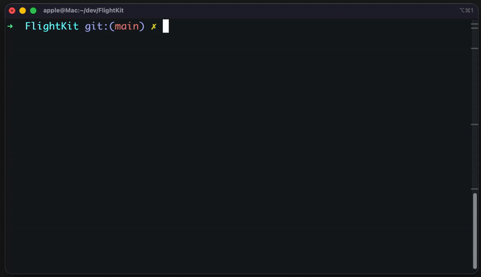

<div align="center">

  <h1>📘 FlightKit</h1>

  <p>
    <strong>A Simple Tool to Collect and Clean Flight Data</strong>
  </p>

  

</div>


---


<p align="center">
  <a href="https://www.python.org/">
    
  </a>
  <a href="https://click.palletsprojects.com/">
    
  </a>
  <a href="https://docs.python-requests.org/">
    
  </a>
  <a href="https://openpyxl.readthedocs.io/">
    
  </a>
  <a href="https://pydantic.dev/">
    
  </a>
  <a href="https://github.com/astral-sh/uv">
    
  </a>
  <a href="https://www.docker.com/">
    
  </a>
</p>

---

## 📋 Executive Summary
در این داکیومنت، به تشریح معماری، ساختار کد و نحوه استفاده از ابزار **FlightKit** پرداخته شده است. هدف اصلی، ارائه یک راهکار بهینه جهت جمع‌آوری و پردازش داده‌های پرواز بوده است.

**مسیر توسعه و چالش‌ها:** برای درک عمیق‌تر تصمیمات اتخاذ شده و آشنایی با روند گام‌به‌گام رفع چالش‌های فنی (از تحلیل اولیه تا پیاده‌سازی نهایی)، دعوت می‌شود **[داستان حل مسئله](docs/FlightKit_Design_Decisions.md)** را از طریق لینک زیر مطالعه فرمایید:

🔗 **[لینک به داستان حل مسئله](https://github.com/sysp0/FlightKit/blob/main/docs/FlightKit_Design_Decisions.md)**


برنامه **FlightKit** یک ابزار خط فرمان (CLI) است که به کاربران امکان می‌دهد داده‌های پروازی را از وب‌سایت‌های رزرو پرواز جمع‌آوری کرده و در قالب فایل Excel ذخیره کنند. این ابزار با استفاده از APIهای عمومی و تکنیک‌های web scraping، اطلاعات پروازها را برای تاریخ‌های مشخص استخراج و در فرمتی قابل استفاده برای تحلیل ارائه می‌دهد.

  

**ارزش افزوده:**

- خودکارسازی فرآیند جمع‌آوری داده‌های پروازی
- صرفه‌جویی در زمان برای مقایسه قیمت‌ها
- فرمت استاندارد Excel برای تحلیل و گزارش‌گیری

## 🎯 Problem Statement

### چالش کسب‌وکاری

مسافران و آژانس‌های مسافرتی نیاز به مقایسه قیمت‌ها و برنامه‌های پروازی از منابع مختلف دارند. این فرآیند به صورت دستی:

- **زمان‌بر** است (بررسی دستی هر پرواز)
- **مستعد خطا** است (کپی دستی اطلاعات)
- **غیرقابل مقیاس** است (نمی‌توان حجم زیادی داده را پردازش کرد)
- **تکراری** است (هر بار باید دوباره جستجو شود)

### محدودیت‌های موجود

- عدم وجود API عمومی رسمی از برخی وب‌سایت‌های پروازی
- نیاز به ورود دستی به وب‌سایت‌ها
- عدم امکان ذخیره‌سازی خودکار داده‌ها  

### اهمیت حل مسئله

- **کاهش زمان جستجو** از ساعت‌ها به دقایق
- **افزایش دقت** در مقایسه قیمت‌ها
- **امکان تحلیل روند** قیمت‌ها در طول زمان


---  
## 💡 Solution Overview

### رویکرد کلی

برنامه FlightKit با استفاده از **Reverse Engineering** APIهای داخلی وب‌سایت‌های پروازی، به جای پارس کردن مستقیم HTML، از endpoint‌های JSON استفاده می‌کند که:

- **پایدارتر** هستند (کمتر با تغییرات UI شکسته می‌شوند)
- **سریع‌تر** هستند (داده‌های ساختاریافته)
- **کارآمدتر** هستند (حجم داده کمتر)
  
### تصمیمات معماری کلیدی
  

#### ✅ چرا CLI به جای GUI?

 **مزایا:**
- قابلیت استفاده در اسکریپت‌ها و Automation
- سبک‌تر و سریع‌تر
- مناسب برای DevOps و CI/CD
- Cross-platform بدون وابستگی گرافیکی

   

#### ✅ چرا Requests به جای Scrapy?

**Trade-off:**
- Scrapy: قدرتمند اما سنگین و پیچیده
- Requests: ساده، سبک، کافی برای نیاز پروژه
- نیاز پروژه با requests بر طرف میشد
  

## 🏗️ System Architecture

### High-Level Architecture

```
┌─────────────┐
│   User      │
│  (Terminal) │
└──────┬──────┘
       │ CLI Command
       ▼
┌─────────────────────────────────────┐
│         FlightKit CLI               │
│  ┌─────────────────────────────┐    │
│  │  Click Command Handler      │    │
│  └────────────┬────────────────┘    │
│               │                     │
│               ▼                     │
│  ┌─────────────────────────────┐    │
│  │   Input Validator           │    │
│  │   (Pydantic Models)         │    │
│  └────────────┬────────────────┘    │
└───────────────┼─────────────────────┘
                │
                ▼
┌─────────────────────────────────────┐
│      Utravs API Client              │
│  ┌─────────────────────────────┐    │
│  │  HTTP Session Manager       │    │
│  │  - Retry Logic              │    │
│  │  - Cookie Management        │    │
│  │  - Header Management        │    │
│  └────────────┬────────────────┘    │
│               │                     │
│               ▼                     │
│  ┌─────────────────────────────┐    │
│  │  API Request Builder        │    │
│  └────────────┬────────────────┘    │
└───────────────┼─────────────────────┘
                │
                ▼
        ┌───────────────┐
        │  Utravs API   │
        │  (External)   │
        └───────┬───────┘
                │ JSON Response
                ▼
┌────────────────────────────────────┐
│      Data Processing Layer         │
│  ┌─────────────────────────────┐   │
│  │  Response Parser            │   │
│  └────────────┬────────────────┘   │
│               │                    │
│               ▼                    │
│  ┌─────────────────────────────┐   │
│  │  Data Transformer           │   │
│  │  (JSON → Python Objects)    │   │
│  └────────────┬────────────────┘   │
│               │                    │
│               ▼                    │
│  ┌─────────────────────────────┐   │
│  │  Data Validator             │   │
│  │  (Pydantic Models)          │   │
│  └────────────┬────────────────┘   │
└───────────────┼────────────────────┘
                │
                ▼
┌────────────────────────────────────┐
│      Excel Export Layer            │
│  ┌─────────────────────────────┐   │
│  │  Excel Writer (OpenPyXL)    │   │
│  │  - Sheet Creation           │   │
│  │  - Cell Formatting          │   │
│  │  - Column Sizing            │   │
│  └────────────┬────────────────┘   │
└───────────────┼────────────────────┘
                │
                ▼
        ┌───────────────┐
        │  Excel File   │
        │  (Output)     │
        └───────────────┘
```

  

### Data Flow Diagram
  
```
User Input (Date)
→ Input Validation (Jalali/Gregorian)
→ Date Conversion (utils.date_converter)
→ API Request Construction
→ HTTP Request (with retry)
→ JSON Response
→ Data Parsing
→ Pydantic Validation
→ Excel Generation
→ File Save (with timestamp)
```

  

## 🔧 Component 

### 1️⃣ **CLI Module** (`cli.py`)

  

**مسئولیت:**

- دریافت ورودی از کاربر
- مدیریت دو حالت: Interactive و Command-based
- نمایش خروجی با Rich formatting
- مدیریت خطاها و نمایش پیام‌های مناسب

  

**کلیدی‌ترین قابلیت‌ها:**

```python
@click.command()
@click.option('--date', '-d', help='Flight date (YYYY-MM-DD or YYYY/MM/DD)')
@click.option('--output', '-o', default='ex.xlsx', help='Output filename')
@click.option('--interactive', '-i', is_flag=True, help='Interactive mode')
def main(date, output, interactive):
    """Main CLI entry point"""
```

  

**الگوهای طراحی:**

- Command Pattern (Click decorators)
- Strategy Pattern (Interactive vs Command mode)


### 2️⃣ **UtravsProvider** (`core/scraper.py`)


**مسئولیت:**

- مدیریت ارتباط با API خارجی
- Session Management
- Retry Logic برای درخواست‌های ناموفق
- Cookie و Header Management

  
**ویژگی‌های کلیدی:**

- حراز هویت خودکار و یک‌باره هنگام اولین درخواست (با متد _authenticate)
- استفاده از requests.Session برای حفظ کوکی‌ها و هدرها در تمام درخواست‌ها
- تولید خودکار TraceId یکتا برای هر درخواست (مطابق استاندارد Utravs)
- مپینگ دقیق و ایمن پاسخ API به مدل Flight با هندل کردن خطاهای ولیدیشن و داده‌های ناقص
  

**الگوهای طراحی:**

- Singleton Pattern (یک Session برای همه درخواست‌ها)
- Retry Pattern با Exponential Backoff
  
### 3️⃣ **Data Models** (`models/`)

  
**مسئولیت:**
- تعریف ساختار داده‌ها
- اعتبارسنجی خودکار
- Type Safety


**مدل‌های اصلی:**  

```python

# Flight
airline_name: str
flight_number: str
departure_time: datetime
arrival_time: datetime
price: int = Field(gt=0, description="Price must be more than 0")
capacity: int = Field(ge=0, description="Capacity cannot be negative")
origin: str
destination: str
  
# SearchCriteria
origin: str = Field(..., min_length=2)
destination: str = Field(..., min_length=2)
date: str = Field(..., pattern=r"^\d{4}-\d{2}-\d{2}$")

```

  

**چرا Pydantic؟**

- ✅ اعتبارسنجی خودکار در runtime
- ✅ Type hints و IDE support
- ✅ JSON serialization/deserialization خودکار
- ✅ مستندسازی خودکار با JSON Schema

---
  
### 4️⃣ **Utilities** (`utils/`)

#### 4.1 Date Converter (`utils/date_converter.py`)

  

**مسئولیت:**

- تبدیل تاریخ شمسی به میلادی
- پشتیبانی از فرمت‌های مختلف ورودی
- اعتبارسنجی تاریخ

  
**چرا jdatetime؟**

- ✅ کتابخانه استاندارد برای تاریخ شمسی در Python
- ✅ API مشابه datetime استاندارد
- ✅ تبدیل دقیق بین تقویم‌ها


#### 4.2 Excel Writer (`utils/excel_writer.py`)
  
**مسئولیت:**
- ایجاد فایل Excel
- فرمت‌بندی سلول‌ها
- تنظیم عرض ستون‌ها
- افزودن timestamp به نام فایل


**چرا OpenPyXL؟**

- ✅ پشتیبانی کامل از فرمت .xlsx
- ✅ امکان استایل‌دهی پیشرفته
- ✅ عدم نیاز به Microsoft Excel
- ✅ Cross-platform

  


### 5️⃣ **Exception Handling** (`exceptions/`)


برای اینکه کاربر درگیر خطا های فنی نشود این موارد رو اضافه میکنیم به سیستم:


```python
from typing import Optional

class FlightScraperException(Exception):
    """
    This is the main error for our project.
    If something goes wrong in our code, we use this error.
    """
    def __init__(self, message: str, original_error: Optional[Exception] = None):
        super().__init__(message)
        self.original_error = original_error

class FlightValidationException(FlightScraperException):
    """
    We use this when the data is wrong.
    Example: Price is zero, or date is in the past.
    """
    pass

class ProviderConnectionException(FlightScraperException):
    """
    We use this when we cannot connect to the website.
    Example: No internet, or the website is down.
    """
    pass

class ProviderAuthenticationException(FlightScraperException):
    """
    We use this when login fails.
    Example: The token is old or wrong.
    """
    pass

class ProviderResponseException(FlightScraperException):
    """
    We use this when the website sends weird data.
    Example: We wanted JSON but got HTML.
    """
    pass

class DataExportException(FlightScraperException):
    """
    We use this when we cannot save the file.
    Example: The Excel file is open, or disk is full.
    """
    pass

```

  

**الگوی طراحی:**

- Exception Hierarchy برای مدیریت بهتر خطاها
- Custom exceptions برای وضوح بیشتر

## 🗂️ Project Structure

  ساختار پروژه به صورت زیر میباشد.

```
FlightKit/
│
├── src/
│   └── flightkit/
│       ├── __init__.py              # Package initialization
│       │
│       ├── main.py                  # CLI entry point
│       │   ├── main()               # Main command
│       │   ├── interactive_mode()   # Interactive session
│       │   └── fetch_command()      # Direct command execution
│       │
│       ├── core/
│       │   ├── __init__.py
│       │   └── scraper.py     # scraper Provider
│       │       └── UtravsProvider
│       │          ├── __init__()
│       │          └── get_flights()
│       │
│       ├── models/
│       │   ├── __init__.py
│       │   ├── flight.py            # Flight data model
│       │   │   └── Flight(BaseModel)
│       │   └── search.py            # Search request model
│       │       └── SearchRequest(BaseModel)
│       │
│       ├── utils/
│       │   ├── __init__.py
│       │   ├── date_converter.py    # Date conversion utilities
│       │   │   ├── convert_to_gregorian()
│       │   │   ├── is_gregorian()
│       │   │   └── validate_date()
│       │   └── excel_writer.py      # Excel file generation
│       │       └── ExcelWriter
│       │           ├── __init__()
│       │           ├── write_flights()
│       │           └── save()
│       │
│       └── exceptions/
│           ├── __init__.py
│           └── errors.py            # Custom exceptions
│               ├── FlightKitException
│               ├── APIConnectionError
│               ├── InvalidDateError
│               ├── NoFlightsFoundError
│               └── ExcelWriteError
│
├── pyproject.toml                   # Project metadata & dependencies
├── README.md                        # Project documentation
├── LICENSE                          # MIT License
└── .gitignore                       # Git ignore rules
```

  
## 🎮 Usage Examples


### 1️⃣ Interactive Mode


```bash
$ flightkit menu

╔══════════════════════════════════════╗
║      FlightKit - Flight Search       ║
╚══════════════════════════════════════╝

? What would you like to do? 
  ❯ Search flights by date
    Exit

? Enter flight date (YYYY-MM-DD or YYYY/MM/DD): 1403/09/15

🔍 Searching flights for 2024-12-05...
⠋ Fetching data from Utravs...

✅ Found 24 flights!

📊 Saving to Excel...
✅ Saved to: flight_database_20241203_143022.xlsx

? What would you like to do? 
  ❯ Search flights by date
    Exit

```

  

### 2️⃣ Command Mode (برای Automation)


```bash

$ flightkit fetch --date 2024-12-05
# OR
$ flightkit fetch -d 1403/09/15 -o tehran_flights.xlsx

# Output :
# ✅ Saved 24 flights to: tehran_flights_20241203_143022.xlsx
```

###  3️⃣ استفاده در Python Script
  

```python
from flightkit.client import UtravsClient
from flightkit.utils.excel_writer import ExcelWriter

client = UtravsClient()

# Search in flights
flights = client.search_flights('2024-12-05')

# Save in Excel
writer = ExcelWriter('my_flights.xlsx')
writer.write_flights(flights)
writer.save()

print(f"✅ Saved {len(flights)} flights")

```


### 🐳 استفاده از Docker

شما می‌توانید به دو روش از داکر استفاده کنید: اجرای سریع (Image آماده) یا بیلد کردن از سورس.

#### روش اول: اجرای سریع (بدون نیاز به کلون کردن)
اگر می‌خواهید بدون دانلود کدها و تنها با یک دستور برنامه را اجرا کنید، از ایمیج بیلد شده استفاده کنید:

```bash
$ docker run --rm -v "$(pwd):/app/artifacts/" ghcr.io/sysp0/flightkit:0.1.0 fetch --date 2025-12-09
```


> **نکته:** عبارت  `v $(pwd):/app/artifacts-` باعث می‌شود فایل اکسل خروجی در پوشه فعلی سیستم شما ذخیره شود.

#### روش دوم: استفاده از Docker Compose (توسعه)
اگر مخزن را کلون کرده‌اید، می‌توانید از دستور زیر استفاده کنید:

```bash
$ docker compose run --rm flightkit fetch --date 2025-12-09 

[+] Creating 1/0
Batch mode - target date set to 2025-12-09
Route: MHD → THR | Date: 2025-12-09
Found 142 flights.
Saved to flight_database.xlsx DONE                                               
```

### 5️⃣ استفاده از uv (بدون نصب و بدون محیط مجازی)

```bash
uv run lightkit fetch --date 2025-12-09 

# With Menu 
uv run lightkit menu
```

## 📦 Installation & Setup

#### 1️⃣  **از GitHub**  

```bash
# Latest Version
pip install git+https://github.com/sysp0/FlightKit.git

# With Version
pip install git+https://github.com/sysp0/FlightKit.git@v0.1.0
```


#### 2️⃣ **Development Installation**

```bash

# Clone repository

git clone https://github.com/sysp0/FlightKit.git
cd FlightKit

# create virtual environment
python -m venv .venv

# activate (Linux)
source .venv/bin/activate

# Insatll in editable
pip install -e .

```

> اگر `uv` دارید هم میتوانید از طریق زیر تمامی پروژه رو نصب کنید و استفاده کنید و تمامی کار هارو انجام میدهد با یک دستور و سریع تر.

```bash
uv sync 
```

با این دستور تمامی نیاز مندی های پروژه داخل پوشه `venv.` نصب میشود.
