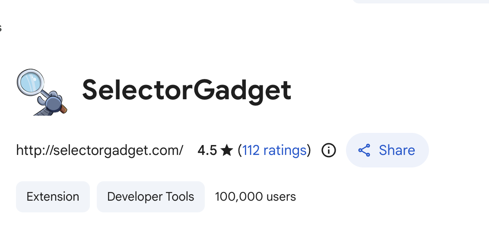
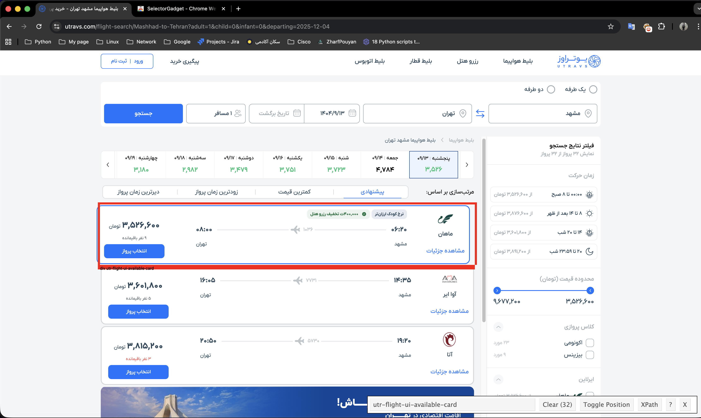
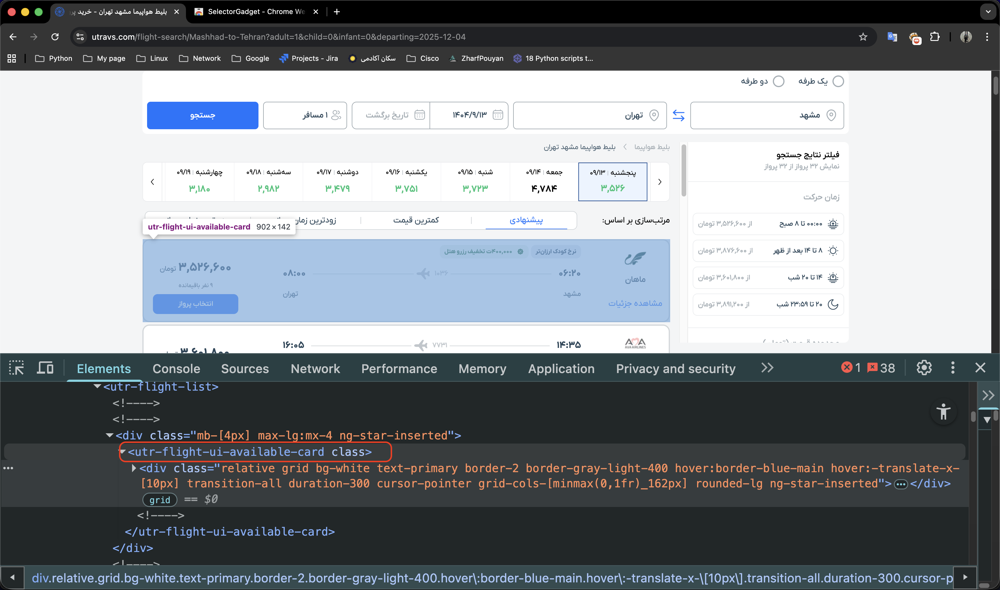
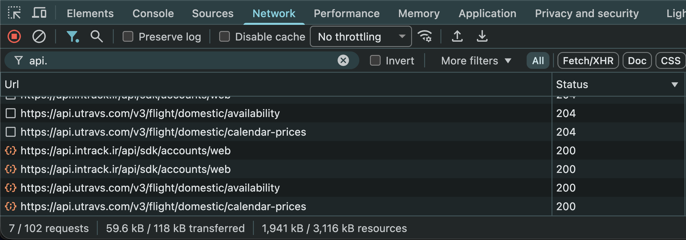

در این داکیومنت مسیری که برای پیاده سازی پروژه `FlightKit` پیش رفته است رو شرح میدم.

# هدف پروژه 
این پروژه مربوط به کرول کردن سایت یوتراوز آژانس هواپیمایی است. در این پروژه الزام است یک اسکریپت Web Scraping طراحی شود که بتواند اطلاعات مربوط به قیمت ها و جزئیات پروازها را از سایت یوتراوز استخراج نماید
داده های جمع آوری شده باید در اکسل ذخیره شوند. 
همچنین انتظار میرود که داده ها پس از استخراج، پاکسازی و اعتبارسنجی شوند تا از صحت و کامل بودن آنها اطمینان حاصل گردد.

نیازمندی های پروژه
- جمع‌آوری لیستی از پروازهای تهران → مشهد برای یک روز مشخص
- پیاده‌سازی با زبان Python
- ذخیره‌سازی داده‌ها در یک فایل Excel

# مرحله صفر
قبل از شروع هرکاری اول باید ساختار کدمون رو مشخص کنیم. ما برای این پروژه از `src layout` به دلیل اینکه از ساختار Flat خیلی بهتر هستش چون هرچیزی در سر جای خودش قرار میگیره و محصول مون قابل نگهداری و توسعه پذیر میشود، و برای هر تغیر نیاز نیست که با چالش مواجه شویم.

> توضیحات بیشتر در مورد ساختار `src layout` از این  [لینک](https://medium.com/@adityaghadge99/python-project-structure-why-the-src-layout-beats-flat-folders-and-how-to-use-my-free-template-808844d16f35) قابل مشاهده است.

در این مرحله ساختار که مشخص شد حالا باید بریم سراغ اینکه بتونم یک `POC` یا `Proof of concept` که ما برای اجرایی ایده مون باید یک تیکه کد که حداقلی هارو به ما میده داشته باشیم.

پس قبل اینکه شروع کنیم به کد نویسی اول باید یک کد خیلی ساده داشته باشیم که کار کنه و بعدش میتونیم بهترش کنیم. 

قبل اینکه شروع کنیم باید پروژه مون رو ایجاد کنیم و یک `pyproject.toml` داشته باشیم که مشخص کنه این یک پکیج هست. ما میتونیم با ابزار `uv` این کار رو انجام دهیم.

دستور `uv init`  ساختار استاندارد پکیج پایتون شامل فایل `pyproject.toml` و محیط مجازی (Virtual Environment) را ایجاد می‌کند.
# مرحله اول -  گرفتن خروجی وب سایت
## اولین تلاش برای خوندن وب سایت
توی این مرحله تلاش میکنیم که حداقلی ترین خروجی رو داشته باشیم. پس سعی میکنیم داخل پایتون با استفاده از کتابخونه `requests` صفحه مورد نظرمون رو بگیریم که در اینجا سایت هدف ما https://utravs.com هستش. 

توی مرحله های بعدی باید از کتابخونه هایی مثل `beautifulsoup4` (که برای وب اسکریپینگ استفاده میشه) کتابخانه ساده برای پارس کردن HTML هستش و برای کار های بسیار کوچیک که میخواهیم سریع خروجی بگیریم خیلی میتونه مفید باشه.

این ابزار یک مقداری استاتیک هستش و برای سایت با جاوااسکریپت سنگین (React, Vue و ...) کارایی لازم را ندارد و نمیتوانیم استفاده کنیم برای سایت های پیچیده تر و صفحات خیلی بیشتر میتونیم از ابزار های زیر استفاده کنیم:

- Scrapy 
- Selenium 
- Playwright

- اگر فقط HTML ساده بخواین → bs4
- مقیاس بالا (Large Scale Crawling) → Scrapy
- جاوااسکریپت، لاگین، کلیک، اسکرول لازم داریم → Selenium یا Playwright

با توجه به اینکه هدف استخراج داده از یک صفحه مشخص بود، در گام نخست تلاش شد تا با استفاده از کتابخانه `BeautifulSoup4` و تحلیل ساختار DOM، اطلاعات پروازها استخراج شود.

داخل این ساختار چون ما فقط با یک صفحه روبرو هستیم پس میریم تلاش میکنیم که با `beautifulsoup4` بتونیم کارت های مربوط به پرواز رو در بیاریم.

برای اینکه بفهمیم کارت های پرواز چه مسیری دارند میتونیم از این افزونه توی کروم استفاده کنیم :



ما با این ابزار میتونیم `Xpath` اون قسمتی که میخواهیم رو توی `html` پیدا کنیم:



همینطور که مشاهده میکنیم تونستیم کلاس کارت های پرواز رو در بیاریم:

`utr-flight-ui-available-card` 




اگر توی این قسمت هم نگاه کنیم کارت های پرواز از این کلاس ساخته شده اند. تا اینجا ما تونستیم کلاس رو پیدا کنیم و ما در نظر داریم بتونم با ابزار `requests` + `bs4` و کارت هایی که این کلاس رو دارند پیدا کنیم و اطلاعات مورد نظرمون رو پیدا کنیم.

ولی سخت در اشتباهیم که ما میتونیم این دیتا رو در لحظه اول داشته باشیم ! 

این دیتا از طرف جاوا اسکریپت آپدیت میشه و دیتای استاتیک نیست، این به چه منظور هستش ؟ یعنی وقتی ما از طریق `requests` درخواست بزنیم اصلا این کارت هارو نمیبنیم. 

دیتای زیر رو میبینیم:

```
<ngx-skeleton-loader appearance="line" _nghost-ng-c1211887358>
  <div>Loading...</div>
</ngx-skeleton-loader>
```

وقتی صفحه وب دینامیک باشه و با جاوااسکریپت (JS) آپدیت بشه، کتابخانه requests در پایتون واقعاً نمی‌تونه JS رو اجرا کنه یا منتظر بمونه تا داده‌ها لود بشن. چون requests فقط HTML خام اولیه رو می‌گیره و هیچ پردازشی روی JS انجام نمی‌ده. مثلاً اگه صفحه‌ای مثل نمونه‌ای که دادی (با ngx-skeleton-loader) داشته باشه، فقط "Loading..." رو می‌بینه و منتظر نمی‌مونه.


پس در این مرحله به این نتیجه میرسیم که با نمیتونیم `html` این سایت رو با استفاده از ابزار های `requests` و `bs4` در بیاریم.


## پیدا کردن روش های جایگزین

ما میتونیم با ابزار ها دیگه ای این قسمت رو پیش ببریم:

استفاده از Selenium (یا ابزارهای مشابه مثل Playwright) برای شبیه‌سازی مرورگر:

این ابزارها یک مرورگر واقعی (مثل کروم یا فایرفاکس) رو کنترل می‌کنن، JS رو اجرا می‌کنن، و منتظر می‌مونن تا صفحه کامل لود بشه.

- مزیت: دقیقاً مثل وقتی که خودت صفحه رو باز می‌کنی کار می‌کنه.
- معایب: کندتر از requests هست و نیاز به نصب درایور مرورگر داره.

این روش روش بسیار خوبی هستش برای سایت هایی که JS دارند و دیتا در لحظه اول در دسترس نیستند ولی یک روش خیلی بهتر داریم که اگر سایت این قابلیت رو داشته باشه کار ما بسیار راحت خواهد بود.

وجود API هایی که وب سایت از اون استفاده میکند یعنی باید دنبال API ای بگردیم که این دیتا های پرواز ها از اونجا خونده و نمایش داده میشود.

برای پیدا کردن این API ها باید بریم داخل تب Network :



اگر اینجارو نگاه کنیم میبینیم که دیتا از طریق یک API که مربوط به موجودیت هستش در دسترس ما قرار میگیرد.

```
https://api.utravs.com/v3/flight/domestic/availability
```

حالا ما باید سعی کنیم از این API خروجی بگیریم

### تلاش برای خروجی گرفتن از API موجودیت
بهترین کار برای گرفتن خروجی یکسان با copy curl هستش :


با این کار تمامی چیز هایی که API ما نیاز دارد تا به ما خروجی دهد کپی میشود. دقیقا این مورد هست:

```bash 
curl 'https://api.utravs.com/v3/flight/domestic/availability' \
  -H 'accept: application/json, text/plain, */*' \
  -H 'accept-language: fa-IR' \
  -H 'content-type: application/json' \
  -b '__utmzzses=1; _gcl_gs=2.1.k....' \
  -H 'origin: https://utravs.com' \
  -H 'priority: u=1, i' \
  -H 'referer: https://utravs.com/' \
  -H 'sec-ch-ua: "Chromium";v="142", "Google Chrome";v="142"' \
  -H 'sec-ch-ua-mobile: ?0' \
  -H 'sec-ch-ua-platform: "macOS"' \
  -H 'sec-fetch-dest: empty' \
  -H 'sec-fetch-mode: cors' \
  -H 'sec-fetch-site: same-site' \
  -H 'time-zone: Asia/Tehran' \
  -H 'traceid: 5df9ceb8-a63e-4651-980e-81ca9980d955' \
  -H 'user-agent: Mozilla/5.0 (Macintosh; Intel Mac OS X 10_15_7) AppleWebKit/537.36 (KHTML, like Gecko) Chrome/142.0.0.0 Safari/537.36' \
  --data-raw '{"adultCount":1,"childCount":0,"infantCount":0,"departureDate":"2025-12-04","origin":"Mashhad","destination":"Tehran","isTour":false}'
```

اگر این دستور رو بزنیم خروجی API دقیقا همون چیزی میشود که داخل وب دریافت کردیم:

```
{"result":{"departingFlights":[{"id":"56573848","groupKey":"20251204_1036_False_339_Economy","priority":0,"capacity":9,"arrivalDateTime":"2025-12-04 08:00","departureDateTime":"2025-12-04 06:20","aircraftName":"\u0627\u0650\u06CC\u0631\u0628\u0627\u0633 310","airlineSmallLogoUrl":"https://cdn.utravs.com/Storage/DownloadFile?fileId=76255\u0026password=19c2e791-526a-4a63-a224-1f64b5f68254\u0026Tag=","airlineLogoUrl":"https://cdn.utravs.com/Storage/DownloadFile?fileId=76254\u0026password=d6490a02-2a44-4f86-8271-5d106c355fc6\u0026Tag=","airlineName":"\u0645\u0627\u0647\u0627\u0646","destination":"THR","destinationAirportName":"\u0645\u0647\u0631\u0622\u0628\u0627\u062F","destinationName":"\u062A\u0647\u0631\u0627\u0646","destinationTer
```

و عبارات فارسی بصورت یونیکد شده هستند : `\u0645\u0627\u0647\u0627\u0646` وقتی ما با `response.json` بخوینم ، پایتون این‌ها رو اتوماتیک به فارسی تبدیل می‌کنه.


>سرور از هدر `Content-Encoding: br` استفاده می‌کند، بنابراین برای Decompress کردن پاسخ در کلاینت، نیاز به کتابخانه `brotli` داریم.


و حالا ما تونستیم دیتا رو از API بخونیم. ولی این همه ماجرا نیست چون باید بتونیم cookies هارو از طریق session دریافت کنیم چون API بدون کوکی ها به ما جوابی بر نمیگردونه:

```bash
$ curl -vv 'https://api.utravs.com/v3/flight/domestic/availability' \
  -H 'Content-Type: application/json' \
  -H 'Accept: application/json' \
  -H 'User-Agent: Mozilla/5.0 ...' \
  -H 'Origin: https://utravs.com' \
  -H 'Referer: https://utravs.com/' \
  --data-raw '{"adultCount":1,"childCount":0,"infantCount":0,"departureDate":"2025-12-04","origin":"Mashhad","destination":"Tehran","isTour":false}'
* Host api.utravs.com:443 was resolved.
> POST /v3/flight/domestic/availability HTTP/2
> Host: api.utravs.com
> Content-Length: 133
* upload completely sent off: 133 bytes
< HTTP/2 403 
< date: Thu, 04 Dec 2025 00:53:48 GMT
< set-cookie: cookiesession1=678B289431707FAB0F0583B5FF349E3D;Expires=Fri, 04 Dec 2026 00:58:15 GMT;Path=/;HttpOnly
< strict-transport-security: max-age=2592000; includeSubDomains; preload
< server: ArvanCloud
< server-timing: total;dur=138
< x-request-id: 3153a455dc9e460dc2d2fc92437d58be
< x-sid: 2065
< 
* Connection #0 to host api.utravs.com left intact
{"success":false,"failedReason":23,"error":{"details":"AppInit required"}}
```

خب حالا اگر ما به خروجی نگاه کنیم که اجازه دسترسی به منابع رو نمیدهد چون هر درخواست به `/availability` باید حتماً یک `session` معتبر داشته باشه که فقط و فقط با فراخوانی `/v2/auth/Authentication/AppInit` ساخته میشه.

پس حالا باید خودمون `APPInit` رو انجام بدیم، بدین صورت تلاش میکنیم که `sessionKey` رو دریافت کنیم:

```bash
➜ curl -s 'https://api.utravs.com/v2/auth/Authentication/AppInit' \
  -H 'Content-Type: application/json' \
  -H 'Origin: https://utravs.com' \
  -H 'Referer: https://utravs.com/' \
  --data-raw '{"appType":3,"appVersion":1,"imeiId":"661341387f0e8251b3ea63b2c0420e01","languageCode":"en-US","platformType":4,"tenantKey":"C7B37B5A-2EAC-4681-A83C-C27C90C58D42","userRoleName":"UtravsSaleUser","projectId":1,"wifiUniqId":""}' \
  --cookie-jar cookies.txt
{"result":{"sessionKey":"a8a9977b-f868-4217-a793-0e107611c707","isLogin":false},"success":true}
```


 این API هم به این صورت کار میکنه که باید یک دیتایی بهش بدیم که به ما `sessionKey` برگردونه. همچنین این API با یک مقدار `tenantKey` هم به ما `sessionKey` رو میدهد. 
```bash
➜ curl -s 'https://api.utravs.com/v2/auth/Authentication/AppInit' \
  -H 'Content-Type: application/json' \
  -H 'Origin: https://utravs.com' \
  -H 'Referer: https://utravs.com/' \
  --data-raw  '{"tenantKey":"C7B37B5A-2EAC-4681-A83C-C27C90C58D42"}'            
{"result":{"sessionKey":"4b5de7be-a601-4671-b499-0c9475b00e28","isLogin":false},"success":true}%
```

در اینجا tenantKey به چه معناست ؟ شناسه مشتری در سیستم Utravs، برای مثال تمامی کسانی که کاربران عادی داخل سایت هستند `tenantKey` این شناسه شون هست. 

تمامی این عملیات رو انجام دادیم تا برسیم به یک کلید : `sessionKey` 

حالا میتوانیم با این کلید دیتا رو بخونیم:

```bash
curl 'https://api.utravs.com/v3/flight/domestic/availability' \
  -H 'accept: application/json, text/plain, */*' \
  -H 'accept-language: fa-IR' \
  -H 'content-type: application/json' \
  -b '_session=4b5de7be-a601-4671-b499-0c9475b00e28' \
  -H 'origin: https://utravs.com' \
  -H 'priority: u=1, i' \
  -H 'referer: https://utravs.com/' \
  -H 'sec-ch-ua: "Chromium";v="142", "Google Chrome";v="142", "Not_A Brand";v="99"' \
  -H 'sec-ch-ua-mobile: ?0' \
  -H 'sec-ch-ua-platform: "macOS"' \
  -H 'sec-fetch-dest: empty' \
  -H 'sec-fetch-mode: cors' \
  -H 'sec-fetch-site: same-site' \
  -H 'time-zone: Asia/Tehran' \
  -H 'traceid: 5df9ceb8-a63e-4651-980e-81ca9980d955' \
  -H 'user-agent: Mozilla/5.0 (Macintosh; Intel Mac OS X 10_15_7) AppleWebKit/537.36 (KHTML, like Gecko) Chrome/142.0.0.0 Safari/537.36' \
  --data-raw '{"adultCount":1,"childCount":0,"infantCount":0,"departureDate":"2025-12-04","origin":"Mashhad","destination":"Tehran","isTour":false}'
```

حالا که تونستیم دیتا رو از API بگیریم ۹۰٪ راه رو پیش رفتیم و تونستیم به یک منطق درستی برای گرفتن اطلاعات برسیم، مخصوصا منطقی که میتونیم توی کد پیاده سازی کنیم. 

# مرحله دوم - شروع برنامه نویسی
تمامی این کار هایی که کردیم رو تبدیل میکنیم به یک اسکریپت که خروجی مورد نظرمون رو خروجی دهد. بعد که کد مورد نظرمون درست کار کرد مرحله اصلی تازه الان شروع میشود **طراحی سیستم** حالا که ما یک برنامه داریم که کار میکند باید یک سری اصول رو پیاده کنیم و باید طبق یک ساختاری کد بزنیم اگر نیاز داشتیم برای مثال سایت های دیگه ای رو هم به این سیستم مون اضافه کنیم خیلی راحت تر انجام شود و هر کسی بتواند سیستمی که ما توسعه دادیم رو توسعه دهد.

> [داکیومنت](https://refactoring.guru/design-patterns/adapter) دیزاین پترن Adapter 


برای این پروژه ما میتونیم از **دیزاین پترن  Adapter** استفاده کنیم. این دیزاین مخصوص اون سیستم هایی هستند که میخواهند رابط‌های (Interfaces) ناسازگار را به یکدیگر متصل کنند و امکان همکاری کلاس‌هایی را فراهم کنند که به دلیل تفاوت در ساختار داده‌ها، نمی‌توانند مستقیماً با هم کار کنند.


**چرا Adapter ؟** از این الگو استفاده کردیم تا **منطق اصلی برنامه** را از **جزئیات دریافت داده** جدا کنیم. به طور خلاصه، آداپتور در اینجا نقش یک مترجم را دارد؛ داده‌های خام و متغیر وب‌سایت (HTML یا JSON) را می‌گیرد و آن‌ها را به یک فرمت استاندارد و تمیز برای استفاده در برنامه تبدیل می‌کند.


در معماری FlightKit، برای رعایت اصل **Separation of Concerns** و جلوگیری از وابستگی منطق برنامه به فرمت داده‌های خارجی، از **الگوی Adapter** استفاده شده است. به طور مشخص، یک لایه تبدیل (Transformation Layer) توسط **Pydantic** ایجاد کردیم که پاسخ‌های ناسازگار API یا HTML را آداپته کرده و به Domain Object های داخلی تبدیل می‌کند. این کار باعث می‌شود اگر فردا API یوتراوز تغییر کند، فقط کافیست لایه آداپتور را تغییر دهیم و نیازی به بازنویسی کل منطق برنامه نیست.


این کار باعث می‌شود اگر در آینده ساختار سایت یوتراوز تغییر کرد یا خواستیم سایت جدیدی را اضافه کنیم، نیازی به بازنویسی کل سیستم نباشد و فقط کافیست لایه آداپتور را به‌روزرسانی کنیم.


> توضیحات کد های پیاده سازی شده و ساختار داخل [ReadMe](https://github.com/sysp0/FlightKit/blob/main/README.md) پروژه به صورت کامل گفته شده و در اینجا فقط روند توسعه بررسی میشود.

در نهایت ما یک کلاس `UtravsProvider` داریم که به سایت هدف ما متصل میشود و دیتا رو استخراج میکند و بر اساس مدل ما که `Flight` هستش، اطلاعات رو در میاورد و از طریق Model عملیات validate دیتا رو انجام میدهد.


```python
# Flight:
airline_name: str
flight_number: str
departure_time: datetime
arrival_time: datetime
price: int = Field(gt=0, description="Price must be more than 0")
capacity: int = Field(ge=0, description="Capacity cannot be negative")
origin: str
destination: str
```

وقتی تمامی دیتا آماده شد در نهایت `ExcelExporter` رو فراخوانی میکنیم و لیست `Flight` رو بهش میدهیم و این کلاس وظیفه ساخت اکسل رو برای ما داره.

# مرحله چهارم - پیاده سازی CLI
زمانی که هسته سیستم رو تکمیل کردیم حالا باید یک User Interface توسعه بدهیم که کاربر فقط ورودی های مورد نیاز رو ورودی دهد و ما تمامی مراحل رو پیش ببریم و در نهایت تمامی دیتا رو در قالب اکسل بهش خروجی بدهیم.

و اینجا یک کتابخونه خوب که تقریبا تمامی نیاز های پروژه `FlightKit` رو بر آورده میکرد کتابخونه `Click` بود که خیلی سریع میتوان یک Command Line Interface رو توسعه بدیم باهاش.


# مرحله پنجم - پیاده سازی Docker
در این نوع پروژه ها خیلی به داکر نیاز نمیباشد ولی برای راحتی کاربر نهایی این محیط قرار داده شده تا در صورت نصب بودن داکر بر روی سیستم تنها با یک دستور براش محیط CLI رو بالا بیاورد تا بتواند در سریع ترین زمان ممکن از ابزار استفاده کند.

